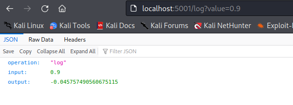
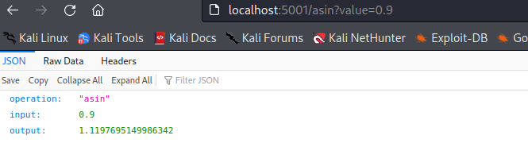
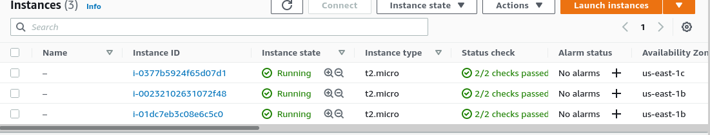
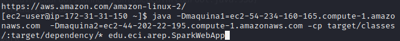
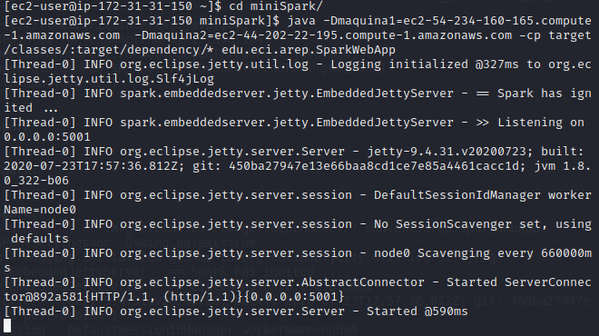
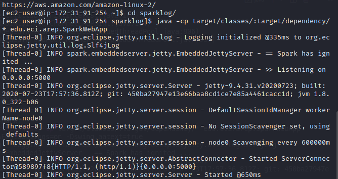
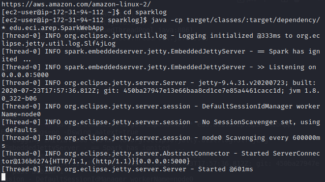
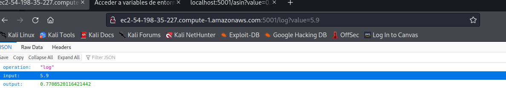

## PARCIAL 2 AREP
### Juan Sebastian Ospina Calderon  CC:1000274606
#### Funciones LOG y ASIN

Para este  Parcial lo que se realizo es lo siguiente:

primero se probaron las instancias del back corriendo en el local host con las funciones

despues creo las maquinas EC2

Ejecutamos las maquinas 
La llamada front que es la que es el proxi tiene el puerto 5001 abierto :

ya que estan ahi las variables de entorno

java -Dmaquina1=ec2-54-234-160-165.compute-1.amazonaws.com  -Dmaquina2=ec2-44-202-22-195.compute-1.amazonaws.com -cp target/classes/:target/dependency/* edu.eci.arep.SparkWebApp

Para las otras dos ejecutamos con el siguiente:

java -cp target/classes/:target/dependency/* edu.eci.arep.SparkWebApp

Verificamos el funcionamiento desde el browser

y verificamos el funcionamiento

shorturl.at/qzGT2
